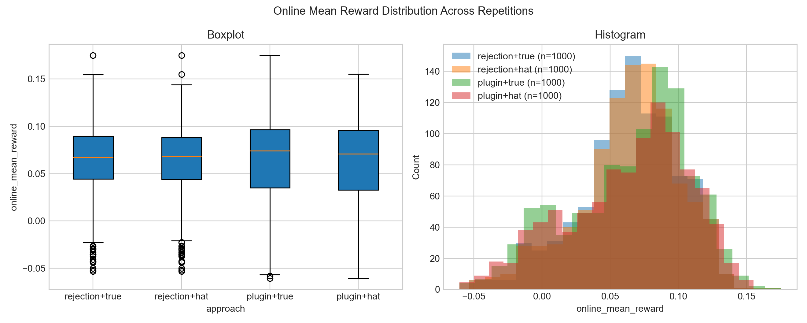
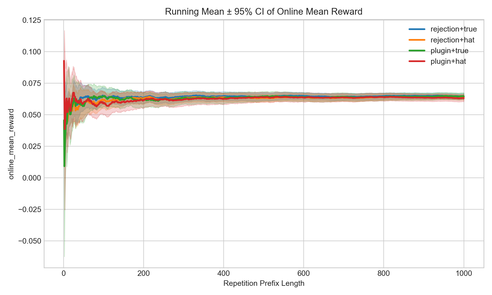

# RL (Bandit) Benchmarks

A framework for building data-driven simulators to evaluate the robustness of bandit algorithms. 

## 📁 Project Structure

* `algorithms/`: **Algorithms**
    * `base_algo.py`: Abstract base class (`select_action`, `update`).
    * `linucb.py`: Baseline LinUCB (Disjoint models).
    * `lints.py`: Baseline Linear Thompson Sampling.
    * `ucb.py`: Classic non-contextual UCB for finite-arm Gaussian bandits.
* `data/`: **Data Utilities**
    * `dataset.py`: Unified offline dataset class (`OfflineBanditDataset`) with split and `.npz` IO.
    * `gen_data.py`: CLI to generate offline datasets from env + behavior policy.
* `envs/`: **Environments**
    * `base_env.py`: Abstract base class. All new environments must inherit this.
    * `synthetic_env.py`: Online linear synthetic bandit environment (known DGP).
    * `data_driven_env.py`: Offline log-driven environment (currently implements Rejection Sampling via Li et al., 2010).
    * `gaussian_two_arm_env.py`: Strict non-contextual two-arm Gaussian environment with shared variance.
* `evaluation/`: **Evaluation**
    * `runner.py`: The universal experiment runner. **(Locked: handles both online and offline without modification).**
    * `visualization.py`: Visualize saved run logs in single-log mode or multi-policy comparison mode (e.g., LinUCB vs LinTS), with cumulative reward/regret plotting and optional mean ± standard deviation bands.
* `IST_simulator/`: **IST Simulator Module**
    * Includes IST-specific simulator code and related experiment components.
* `logs/`: **Experiment Logs & Artifacts**
    * Default output directory for generated `.npz` logs, plots, datasets, and serialized simulators.
* `simulator_generation/`: **Simulator Generation (WIP)**
    * Core research module for converting real datasets into interactive simulators or distributions of simulators.
    * `gaussian_plugin_generator.py`: Plugin/fitted Gaussian simulator generator from offline logs.
* `synthetic_experiments/`: **Synthetic Experiments**
    * `run_online_synthetic.py`: **Online synthetic baseline entrypoint**.
    * `test_offline_rejection.py`: **Offline rejection-sampling pipeline (load `.npz` dataset, evaluate, and visualize)**.
    * `meta_pipeline.py`: **Multi-Site Generalization Test**.
    * `gaussian_repetition_pipeline.py`: End-to-end Gaussian repetition pipeline (offline build/tune + online evaluation).
    * `gaussian_repetition_variance.py`: Gaussian repetition pipeline with variance diagnostics (sigma estimation analysis).

## 🚀 Quick Start

Run the following scripts from the root directory to verify the framework:

### 1. Online Synthetic Baseline
Tests LinUCB in a perfectly linear, online synthetic environment.
```bash
python synthetic_experiments/run_online_synthetic.py
```
> **Takeaway:** The algorithm converges smoothly, achieving a clean sub-linear cumulative regret (~33).

### 2. Offline Evaluation (Rejection Sampling)
Runs a file-driven offline OPE workflow: load dataset generated by `data/gen_data.py`, run LinUCB in rejection-sampling mode, and save both evaluation logs and plots.
```bash
python synthetic_experiments/test_offline_rejection.py \
    --dataset_path logs/offline_dataset.npz \
    --log_path logs/offline_rejection_run.npz \
    --plot_path logs/offline_rejection_cum_reward.png \
    --no_show
```
Optional fallback (only if dataset file is missing): add `--generate_if_missing`.

### 3. Save Logs + Visualize Cumulative Reward and Regret
`synthetic_experiments/test_offline_rejection.py` already performs one-click evaluation + visualization when `--plot_path` is provided (default behavior).

Run offline evaluation (generates `logs/offline_rejection_run.npz` by default):
```bash
python synthetic_experiments/test_offline_rejection.py --dataset_path logs/offline_dataset.npz --no_show
```

For online baseline with a custom log path:
```bash
python synthetic_experiments/run_online_synthetic.py
```

Plot cumulative reward from a saved log (if the `.npz` contains a `cumulative_regret` array key, the script also auto-generates a regret figure):
```bash
python evaluation/visualization.py \
    --log_path logs/offline_rejection_run.npz \
    --output_path logs/offline_rejection_cum_reward.png \
    --no_show
```
This command saves:
- `logs/offline_rejection_cum_reward.png`
- `logs/offline_rejection_cum_regret.png` (auto-derived filename when `cumulative_regret` exists in the `.npz`)

Or
```bash
python evaluation/visualization.py \
    --log_path logs/online_synthetic_run.npz \
    --output_path logs/online_synthetic_cum_reward.png \
    --no_show
```

Compare multiple policies in one figure (mean curve + standard deviation band):
```bash
python evaluation/visualization.py \
    --policy_logs "LinUCB=meta_syn_logs/eval_site_*_linucb.npz" \
    --policy_logs "LinTS=meta_syn_logs/eval_site_*_lints.npz" \
    --metrics cumulative_reward cumulative_regret \
    --output_path meta_syn_logs/policy_compare.png \
    --no_show
```

### 4. Generate Offline Dataset from Any Env + Behavior Policy
`data/gen_data.py` now supports a unified offline dataset format, optional train/test split, and simulator serialization.

Example (random behavior policy in synthetic env):
```bash
python data/gen_data.py \
    --env_class envs.synthetic_env.LinearSyntheticEnv \
    --env_kwargs '{"n_actions": 5, "context_dim": 10, "noise_std": 0.1}' \
    --behavior_policy random \
    --n_steps 50000 \
    --output_path logs/offline_dataset.npz \
    --test_size 0.2 \
    --simulator_output_path logs/offline_simulator.pkl
```

Example (LinUCB as behavior policy):
```bash
python data/gen_data.py \
    --behavior_policy linucb \
    --policy_kwargs '{"alpha": 1.0}'
```

Example (LinTS as behavior policy):
```bash
python data/gen_data.py \
    --behavior_policy lints \
    --policy_kwargs '{"lam": 1.0, "sigma": 1.0, "seed": 42}'
```

Generated files:
- main dataset: `logs/offline_dataset.npz`
- split datasets: `logs/offline_dataset_train.npz`, `logs/offline_dataset_test.npz`
- pickled simulator: `logs/offline_simulator.pkl`

### 5. Meta-Bandit: Multi-Site Generalization Test
Runs the complete meta-learning pipeline: collects pooled offline data from multiple training sites, tunes hyperparameters purely offline on a combined simulator, and evaluates generalization across a distribution of novel testing sites.
```bash
python synthetic_experiments/meta_pipeline.py
```
> **Takeaways:**
> * **Offline Tuning Works:** Successfully identifies optimal hyperparameters purely from the combined rejection-sampling simulator without real-world interaction.
> * **Site Variability (Robustness):** Even when tasks share a meta-distribution ($P_\theta$), algorithms exhibit high variance in regret across different novel sites. This proves that evaluating on a single DGP is insufficient; evaluating robustness across a distribution is necessary.
> * **Algorithm Comparison:** Provides a rigorous baseline comparison (e.g., LinUCB vs. LinTS) across the distribution of tasks, serving as a benchmark for future complex algorithms.


## 📝 Update Log 20 Feb

### Modified
- `evaluation/runner.py`: Take `log_path` as an input to `run_experiment`; save logs before returning metrics, and define a new `save_logs` function to create the directory and persist the logs.
- `envs/data_driven_env.py`: Added `build_simulator`, `save_simulator`, and `load_simulator` to support creating a rejection-sampling environment, serializing the current environment object to a pickle file, and deserializing it for reproducible offline evaluation.
- `main.py` and `test_offline_rejection.py`: Added `log_path` support to define where run logs are saved, with logging output to show the final saved log location.

### Added
- `evaluation/visualization.py`: Added a visualization utility that supports both single-log plotting and multi-policy comparison in one figure (e.g., LinUCB vs LinTS), with automatic cumulative reward/regret plotting and optional mean ± standard deviation bands.
- `data/__init__.py`: Added package initialization for the data module to support clean imports across scripts.
- `data/dataset.py`: Added `OfflineBanditDataset`, a unified dataset container with schema validation, subset/split helpers, and `.npz` save/load support.
- `data/gen_data.py`: Added a CLI pipeline to generate offline logs from configurable environments and behavior policies, with optional train/test split and simulator serialization.
- `algorithms/lints.py`: Added a main-project LinTS (Linear Thompson Sampling) implementation aligned with IST `linear_ts` logic, and enabled `--behavior_policy lints` in `data/gen_data.py`.

## 📝 Update Log 24 Feb

### Modified
- `evaluation/visualization.py`: Added repetition-level plotting support for synthetic Gaussian experiments, including (1) mean-reward distribution plots and (2) running mean ± 95% CI curves by repetition prefix.
- `synthetic_experiments/gaussian_repetition_pipeline.py`: Integrated automatic plotting for both distribution and running CI outputs; pipeline now writes repetition CSV and two figures in one run.

### Added
- `envs/gaussian_two_arm_env.py`: Added a strict non-contextual two-arm Gaussian environment with shared variance and configurable gap (`delta`) for true environment rollouts.
- `algorithms/ucb.py`: Added classic non-contextual UCB algorithm (empirical mean + confidence bonus) for finite-arm Gaussian bandits.
- `simulator_generation/gaussian_plugin_generator.py`: Added plugin/fitted simulator generator that estimates `mu_hat` and pooled `sigma_hat^2` from offline logs and produces Gaussian simulator instances.
- `synthetic_experiments/gaussian_repetition_pipeline.py`: Added an end-to-end repetition pipeline for the loop: sample offline data, build rejection/plugin simulators, tune UCB on simulator, evaluate on true env, and export repetition-level metrics.

### Experiment Commands
Run the experiment setting (delta=0.2, sigma=0.5), default alpha grid = [0.25, 0.5, 1.0, 2.0, 4.0]:
```bash
python synthetic_experiments/gaussian_repetition_pipeline.py \
    --repetitions 200 \
    --offline_data_steps 5000 \
    --offline_eval_steps 1000 \
    --online_eval_steps 1000 \
    --offline_trials 5 \
    --delta 0.2 \
    --sigma 0.5 \
    --no_show \
    --csv_output logs/gaussian_repe_plug_rej/gaussian_repetition_results.csv \
    --plot_output logs/gaussian_repe_plug_rej/gaussian_repetition_mean_reward.png
```


### Experiment Results

Global best beta (by highest mean online reward among all repetitions):

| approach | best_alpha | online_mean_reward |
|---|---:|---:|
| plugin | 1.0 | 0.189987 |
| rejection | 0.5 | 0.190975 |

Overall online mean reward summary (across all repetitions, per-repetition with its optimal alpha):

| approach | mean | std | count |
|---|---:|---:|---:|
| plugin | 0.178090 | 0.052756 | 200 |
| rejection | 0.174483 | 0.061269 | 200 |


## 📝 Update Log 3 Mar

### Experiment Example (Gaussian Repetition)

```bash
python synthetic_experiments/gaussian_repetition_pipeline.py \
    --repetitions 1000 \
    --offline_data_steps 100 \
    --offline_eval_steps 30 \
    --online_eval_steps 2000 \
    --offline_trials 20 \
    --alpha_grid "np.logspace(-2, 1.3, 18)" \
    --delta 0.1 \
    --sigma 1.0 \
    --n_jobs -2 \
    --no_show \
    --csv_output logs/gaussian_repe_plug_rej/gaussian_repetition_results.csv \
    --plot_output logs/gaussian_repe_plug_rej/gaussian_repetition_mean_reward.png
```


### Sigma Comparison

- `sigma_true` (correctly specified variance): use the true environment standard deviation (`args.sigma`, e.g., `1.0`) as UCB exploration scaling.
- `sigma = sigma_hat` (estimated standard deviation): estimate from offline rewards and use that estimate as UCB exploration scaling.

Formula used for the estimate:

$$
\hat{\sigma} = \sqrt{\frac{\sum_{a=1}^{K} n_a s_a^2}{\sum_{a=1}^{K} n_a}}
$$

where $s_a^2$ is the sample variance of rewards on arm $a$, and $n_a$ is its sample count. If any arm has fewer than 2 samples, fallback to global sample standard deviation:


$$
\hat{\sigma} = \sqrt{\operatorname{Var}(r_1,\dots,r_n)}
$$


### Experiment Plots



